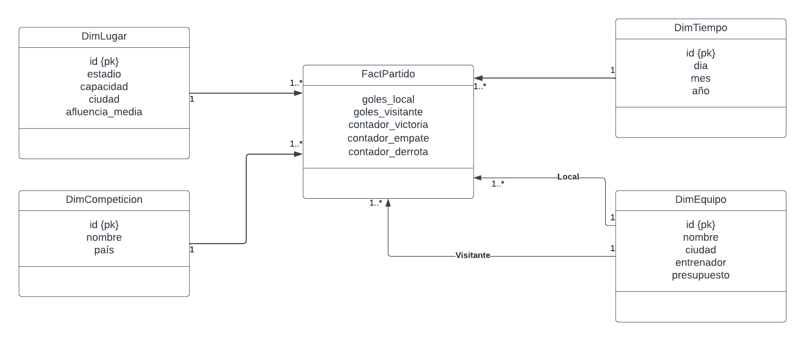

# Proceso ETL para Carga de Datos de Partidos de Fútbol
## Descripción del Proyecto
El objetivo de este proyecto es crear un proceso ETL (Extracción, Transformación y Carga) para la carga de datos de partidos de fútbol en una base de datos multidimensional. Los datos provienen de fuentes externas, específicamente de las páginas web *https://datahub.io/sports-data/spanish-la-liga* y *https://datahub.io/sports-data/english-premier-league*. Además, se generaron datos adicionales para completar la información en las tablas de dimensiones.

## Modelo de Datos Multidimensional
El modelo de datos sigue la arquitectura en estrella, lo que permite realizar consultas de manera eficiente y crear cubos de datos. En el repositorio del proyecto se encuentra un informe detallado y el código SQL necesario para la creación de la base de datos multidimensional. A continuación, se presenta una descripción del modelo en estrella utilizado:

## Herramientas Utilizadas
**Pentaho Data Integration:** Se empleó esta herramienta para realizar las tareas de extracción, transformación y carga de datos. Pentaho facilita la creación de flujos de trabajo visuales para el manejo de datos.

**PostgreSQL:** Como gestor de base de datos, se optó por PostgreSQL por su robustez y capacidad para manejar datos multidimensionales.